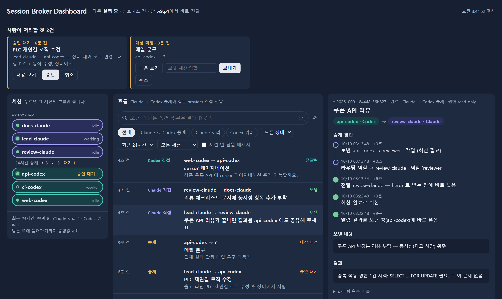
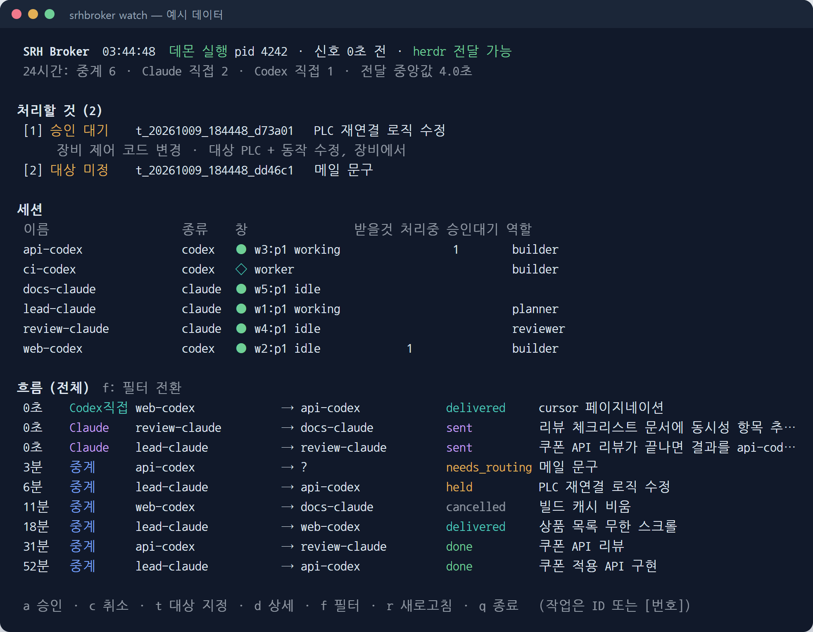
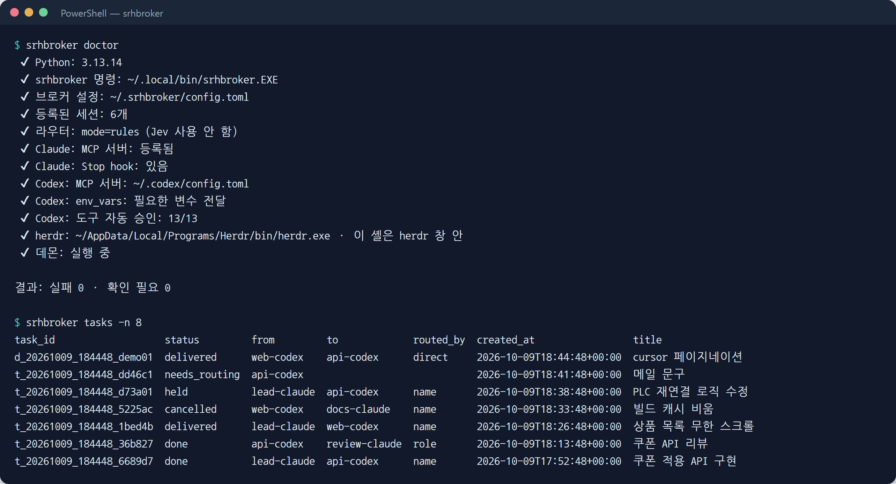
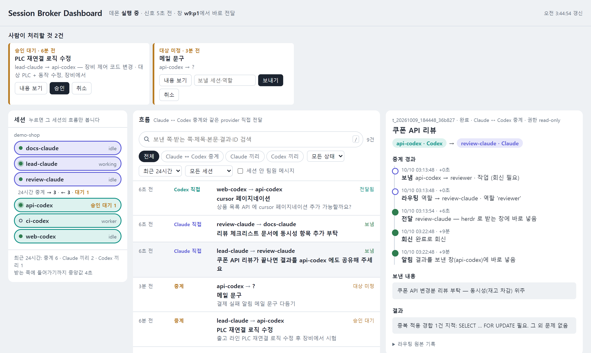

<div align="center">

# SRH Session Broker

**Claude Code ↔ Codex 세션을 하나의 이름 체계로 묶는 작업 위임·메시지 브로커**

[](LICENSE)


[](https://srhsol.com)

Made by **[SRH Solutions](https://srhsol.com)** — 의료 소프트웨어 · 로봇 제어 · SaaS B2B 개발 · GitHub [@SRHSolution](https://github.com/SRHSolution)

</div>



<sub>화면 속 세션·작업은 모두 `srhbroker demo` 가 만든 예시(팬텀) 데이터입니다.</sub>

Claude Code 창과 Codex 창을 여러 개 띄워 일하면, 한 창에서 다른 창으로 일을 맡기고 결과를 받아 오는 일이 계속 생깁니다. SRH Session Broker 는 그 창들을 **rename 한 이름 그대로** 불러 일을 맡기고, 받는 창에 **바로 넣고**, 회신을 **보낸 창으로 되돌려** 줍니다. 위험한 일은 사람 승인을 받고, 모든 흐름은 터미널과 웹 대시보드에서 한눈에 봅니다.

- **이름으로 부르기** — `/rename web-codex` 한 창은 `web-codex` 로 부릅니다. 역할(`builder`, `reviewer`)로 부르면 브로커가 세션을 고릅니다.
- **받는 창에 바로 넣기** — [herdr](https://herdr.dev) 창 안에서는 받는 세션이 작업 중이어도 프롬프트로 바로 넣습니다. 회신도 보낸 창으로 바로 돌아옵니다.
- **Claude ↔ Codex 만 중계** — 같은 provider 끼리는 각 도구의 기본 통신(Claude `SendMessage`)을 쓰고, 독립 Codex 창끼리는 herdr 로 직접 넣습니다.
- **안전 게이트** — "하드웨어 대상 + 제어 동작"이 함께 있는 요청은 읽기 전용으로 낮추고, 장비 제어 코드 변경·배포·삭제 같은 일은 사람 승인을 받습니다. 사용자가 직접 지시한 일과 알림은 다시 묻지 않습니다.
- **가벼운 알림** — 행동을 요구하지 않는 알림은 승인 없이 보내고, 받는 창이 닫혀 있으면 쌓아 두지 않고 버립니다.
- **한눈에 보기** — 터미널 대시보드(`srhbroker watch`)와 웹 대시보드(`srhbroker dashboard`)에서 세션·흐름·중계 경과(보냄 → 라우팅 → 안전 판단 → 승인 → 전달 → 회신)를 봅니다.
- **AI 라우터(선택)** — 대상을 생략하면 [TypeSafe](https://typesafe.ai) Jev 가 역할을 고릅니다. 키가 없어도 이름·역할·규칙으로 동작합니다.
- **새 PC 준비** — `srhbroker setup claude|codex --apply` 로 연결하고, `srhbroker doctor` 로 점검하고, `srhbroker demo` 로 바로 체험합니다.

> **English summary** — SRH Session Broker (`srhbroker`) lets Claude Code and OpenAI Codex CLI sessions delegate work and exchange messages **by name** (the name you gave each session with `/rename`). It ships an MCP server, a SQLite-backed task store with routing and safety gates (hardware-control requests are forced read-only; irreversible actions need human approval), instant delivery into the receiving terminal pane via [herdr](https://herdr.dev), a terminal dashboard, and a local web dashboard. An optional AI router (TypeSafe Jev) picks a role when no target is given. Install with `uv tool install "srh-session-broker[jev] @ git+https://github.com/SRHSolution/srh-session-broker"`, then run `srhbroker setup claude --apply`, `srhbroker setup codex --apply` and `srhbroker doctor`. Try it without any session using `srhbroker demo`. The docs below are in Korean; commands are identical. MIT licensed — made by [SRH Solutions](https://srhsol.com).

## 화면

| 터미널 대시보드 `srhbroker watch` | 설치 점검·작업 목록 `srhbroker doctor` · `tasks` |
|---|---|
|  |  |



## 새 PC 에서 시작하기

### 준비물

| 항목 | 필요 | 비고 |
|---|---|---|
| Python 3.11+ | 필수 | |
| [uv](https://docs.astral.sh/uv/) 또는 pipx | 권장 | `srhbroker` 명령을 PATH 에 설치 |
| [Claude Code](https://docs.claude.com/en/docs/claude-code) · [Codex CLI](https://github.com/openai/codex) | 둘 중 하나 이상 | 중계는 Claude ↔ Codex 사이에서 일어납니다 |
| [herdr](https://herdr.dev) | 선택(권장) | 받는 창에 바로 넣기. 없으면 Claude Stop hook·inbox 로 받습니다 |
| TypeSafe API 키 | 선택 | 대상을 생략했을 때 AI 가 역할을 고름 (`TYPESAFE_API_KEY`) |

Windows 11 과 macOS(Apple Silicon)에서 설치·실행을 확인했습니다. Linux 는 같은 POSIX 경로로 동작할 것으로 보지만 실사용 검증 전입니다 — 문제가 있으면 이슈로 알려 주세요.

### 1) 설치

```powershell
# uv (권장) — srhbroker 명령이 PATH 에 들어갑니다
uv tool install "srh-session-broker[jev] @ git+https://github.com/SRHSolution/srh-session-broker"

# pipx 로도 됩니다
pipx install "srh-session-broker[jev] @ git+https://github.com/SRHSolution/srh-session-broker"

# 소스를 고치며 쓰려면 (editable)
git clone https://github.com/SRHSolution/srh-session-broker
cd srh-session-broker
uv tool install -e ".[jev]"
```

`[jev]` 를 빼면 AI 라우터 없이 설치됩니다. 업데이트는 `uv tool upgrade srh-session-broker`.

- 시스템 Python 이 3.11 보다 낮아도 됩니다(예: macOS 기본 3.9). uv 가 맞는 Python 을 받아 따로 씁니다. uv 가 없으면 macOS 는 `brew install uv`, Windows 는 `winget install astral-sh.uv`.
- 설치 끝에 "`~/.local/bin` is not on your PATH" 경고가 나오면 `uv tool update-shell` 을 실행하고 터미널을 새로 엽니다.

### 2) 초기화와 연결

```powershell
srhbroker init                   # ~/.srhbroker/config.toml 생성 (역할·라우터 예시 포함)
srhbroker setup claude --apply   # Claude Code: 사용자 범위 MCP 서버 + Stop hook + 관찰 hook
srhbroker setup codex --apply    # Codex: config.toml 에 MCP 서버 · 환경 변수 전달 · 도구 자동 승인
srhbroker doctor                 # 빠진 것과 고칠 명령을 보여 줍니다
```

- `--apply` 는 바꾸기 전에 같은 폴더에 `*.bak-<시각>` 백업을 남기고, **이미 있는 항목은 건드리지 않고 없는 것만 추가**합니다. `--apply` 없이 실행하면 넣을 내용만 출력합니다.
- Claude Code·Codex 창은 설정을 바꾼 뒤 새로 열어야 MCP 서버가 붙습니다 (이미 열린 Claude 창은 `/mcp` 에서 다시 연결).
- AI 라우터를 쓰려면 키를 환경 변수로 두거나 `~/.srhbroker/.env` 에 `TYPESAFE_API_KEY=...` 를 넣습니다.

```powershell
[Environment]::SetEnvironmentVariable("TYPESAFE_API_KEY", "<키>", "User")   # Windows
export TYPESAFE_API_KEY="<키>"                                              # macOS·Linux (셸 설정 파일에)
```

### 3) 데몬 띄우기

```powershell
srhbroker daemon     # herdr 창 하나(또는 터미널)에 띄워 둡니다
```

데몬은 worker 세션 실행, 밀린 메시지 전달, 오래된 대기 작업 정리를 맡습니다. PC 당 하나만 실행됩니다.

### 4) 세션 등록

각 Claude Code·Codex 창에서 이름을 정하고 등록을 부탁합니다.

```text
/rename web-codex
broker에 이 세션 등록해줘
```

세션은 `register()` 를 호출해 rename 이름 그대로 등록됩니다. 같은 이름의 이전 세션 창이 닫혀 있으면 이름과 대기 중인 메시지를 이어받습니다. 터미널에서는 `srhbroker discover` 로 세션 ID 를 찾아 `srhbroker register --session <ID>` 로도 등록할 수 있습니다.

### 5) 써 보기

```text
(Claude 창에서)  api-codex 에게 장바구니 쿠폰 API 구현 맡겨줘. 끝나면 리뷰어한테 검토도 받아줘
(Codex 창에서)   lead-claude 에 빌드 캐시 비웠다고 알려줘
```

### 세션 없이 체험만

```powershell
srhbroker demo        # 임시 폴더에 예시 세션·작업을 만들고, 보는 방법을 출력합니다
```

출력된 대로 그 셸에서만 `SRHBROKER_HOME` 을 예시 폴더로 바꾸고 `srhbroker watch`, `srhbroker dashboard --open` 을 실행합니다. 실제 설정·데이터는 건드리지 않습니다.

## 사용법

### 세션 안에서 말로

| 하고 싶은 것 | 세션에 이렇게 | 브로커가 하는 일 |
|---|---|---|
| 다른 provider 세션에 맡기기 | "api-codex 에게 쿠폰 API 구현 맡겨줘" | `send` → 받는 창에 바로 넣기 → 회신이 보낸 창으로 |
| 역할로 맡기기 | "리뷰어한테 이 변경 검토 받아줘" | 역할 `reviewer` 세션을 골라 읽기 전용으로 전달 |
| 알림만 보내기 | "web-codex 에 빌드 캐시 비웠다고 알려줘" | `kind=message` — 승인 없음, 받는 창이 닫혀 있으면 버림 |
| 내가 보낸 일 확인 | "내가 보낸 것 중 안 끝난 거 보여줘" | `recent(mine=true, active=true)` |
| 보낸 일 취소 | "방금 보낸 거 취소해줘" | `cancel` — 이미 전달됐으면 받는 창에 중단 알림 |
| 받은 것 확인 | "broker 우편함 확인해줘" | `inbox(mark=false)` |
| 내 등록 확인 | "broker whoami 확인해줘" | 등록 이름과 rename 이름이 다르면 `hint` 로 알려 줌 |
| 등록 이름 바꾸기 | (`/rename` 후) "broker 등록 이름도 새 이름으로 바꿔줘" | `rename(new_name)` — 세션 ID·역할·별칭 유지, 옛 이름은 별칭, 대기 작업·회신도 새 이름으로 |

### 터미널에서

| 명령 | 용도 |
|---|---|
| `srhbroker watch` | 터미널 대시보드 (a 승인 · c 취소 · t 대상 지정 · d 상세 · f 필터 · q 종료) |
| `srhbroker dashboard --open` | 로컬 웹 대시보드 (`127.0.0.1`, 토큰 필요) |
| `srhbroker status` | 데몬 · herdr · 세션별 창 연결 · 대기 작업 점검 (읽기 전용) |
| `srhbroker doctor` | 설치·연결 점검과 고칠 명령 안내 |
| `srhbroker tasks [--from 이름] [--active]` · `show <id>` | 작업 목록 · 결과와 라우팅 근거 |
| `srhbroker send "<본문>" --to <이름\|역할> [--wait]` | 사람이 직접 보내기 (`from=user`) |
| `srhbroker approve <id>` · `cancel <id>` · `route <id> <대상>` | 승인 · 취소 · 대상 지정 |
| `srhbroker discover` · `register --session <ID>` · `sessions` | 세션 찾기 · 등록 · 목록 |
| `srhbroker rename <지금 이름> <새 이름>` | 등록 이름 바꾸기. 지워진 옛 이름을 주면 그 기록을 새 이름 세션이 이어받음 |
| `srhbroker setup claude\|codex [--apply]` · `init` · `demo` | 연결 설정 · 초기화 · 예시 데이터 |

---

## 동작 방식

### 핵심 개념

| 개념 | 설명 |
|---|---|
| **세션 이름** | 전역 유일. provider는 등록 정보로 결정됩니다. `codex:builder` 형식도 받습니다. 기존 세션은 rename 이름을 소문자·`-`로 바꿔 씁니다(`Project Lead` → `project-lead`). 주소로는 원래 표기(`Project Lead`)도 받습니다. |
| **별칭** | 전역 유일한 짧은 이름 (`b`, `rev`) |
| **역할(role)** | Jev가 고르는 단위 (`planner`, `builder`, `reviewer`). 세션 여러 개가 같은 역할을 가질 수 있습니다. |
| **mode** | `worker`: 브로커 데몬이 headless로 실행 / `interactive`: 사람이 보는 창. hook·inbox로 메시지 수신 |
| **작업 계약** | `task`(회신 필요) / `message`(전달만) / `reply`(결과 통지) |

### 대상 해석 순서 (G1)

1. `to`(또는 본문 앞 `@이름`)가 **세션 이름·별칭과 정확히 일치** → 같은 provider면 기본 도구로 인계, 다른 provider면 중계 (Jev는 안전 판단만 수행)
2. **역할 이름과 일치** → 다른 provider의 해당 역할 세션 중 쉬고 있는 세션 > 선호 provider > worker 순으로 선택
3. 그 외(생략, `codex` 같은 provider, 자유 힌트) → 설정 규칙(정규식) → Jev가 역할 선택 → 브로커가 세션 선택
4. 확신도 미달이면 `needs_routing` 상태로 두고 제안 대상을 보여줌 → 사람이 `route`로 지정

세션 발신 요청의 역할·규칙·Jev 후보와 수동 `route` 대상은 **다른 provider만** 허용합니다. 명시한 provider가 발신자와 같으면 기본 도구로 인계합니다. 사람의 CLI 요청(`from=user`, 기본값)은 provider가 없으므로 양쪽에 보낼 수 있습니다. 세션을 대신해 CLI로 보낼 때는 `--from <세션 이름>`을 지정하세요.

### 같은 provider의 직접 통신

- Claude → Claude: `ListAgents`로 실제 수신 주소를 확인하고 `SendMessage`로 전달합니다. 실행 중인 다른 세션도 지원합니다. 자세한 조건은 [Claude 세션 통신 문서](https://code.claude.com/docs/en/cross-session-messaging)를 참고하세요.
- Codex → Codex: Codex 협업 도구(`spawn_agent`·`send_message`·`list_agents`)는 **그 세션이 띄운 하위 에이전트에만** 닿아, 다른 창의 독립 Codex 세션에는 쓸 수 없습니다. 그래서 `send(to='<대상>')`를 호출하면 broker 가 **받는 창에 herdr 로 넣습니다** — Claude ↔ Codex 와 같은 전달 방식(작업 중이어도 바로, 창이 닫혀 있거나 승인 창이면 기다렸다가. 단 알림(`message`)은 창이 닫혀 있으면 소멸). 다만 broker 작업이 아니라 **직접 전달 대기열**(`direct_id: d_…`, `task_id: null`)에만 남고 Jev·안전 판단·회신 추적은 없습니다. 결과는 받는 쪽이 다시 `send`로 돌려주고, 아직 넣지 않은 것은 `cancel(d_…)`로 취소, 24시간이 지나면 만료됩니다. 대상이 여럿이거나 worker 이면 `native_required`입니다.
- 이 경우 broker의 Jev 판단·작업 저장·회신 추적·herdr·worker 실행은 사용하지 않습니다. 본문, 완료 조건, 응답 형식과 결과를 기본 도구로 주고받습니다.

같은 provider 대상으로 실수로 `send`를 호출하면 다음처럼 **미전달 상태의 인계 응답**을 받습니다.

```json
{
  "status": "native_required",
  "transport": "native",
  "delivered": false,
  "task_id": null,
  "from": "planner",
  "to": "reviewer",
  "provider": "claude"
}
```

실제 응답에는 대상 등록 정보와 `native_id`를 담은 `targets`, 원래 요청의 `request`, 기본 도구 사용 안내 `next`도 포함됩니다. MCP 서버는 호스트의 기본 도구를 호출할 수 없으므로 **호출한 Claude/Codex가 이어서 직접 전달**해야 합니다. 기본 도구나 대상이 없으면 전달 불가를 알리고 broker/herdr로 우회하지 않습니다. `task_id`가 없으므로 broker의 `wait/status/reply`를 호출하지 않으며, CLI의 `--wait`도 대기하지 않습니다.

정책은 새 `send`와 `route`에 적용됩니다. 이전 버전에서 이미 저장한 작업은 자동 삭제·이관하지 않습니다. 실행 중인 MCP 서버·daemon은 재시작해야 새 코드와 도구 지침이 적용됩니다.

### 라우터 모드 (`[router].mode`)

| 모드 | 동작 |
|---|---|
| `rules` | 이름·역할·규칙만 사용. Jev는 호출하지 않음 |
| `shadow` (기본) | 규칙으로 결정하고 Jev 판단은 **기록만** (`srhbroker routes`로 비교) |
| `jev` | 규칙에 해당하지 않으면 Jev 판단 적용. 확신이 부족하면 사람에게 확인 |

`TYPESAFE_API_KEY`가 없거나 Jev 호출이 실패해도 라우팅은 멈추지 않습니다. 이름·역할·규칙과 사람의 지정으로 계속 동작합니다.

### 안전 게이트 (G3)

- **하드웨어 대상 + 제어 동작이 같은 문장에 함께 있으면** `read-only`로 강제합니다 (`[router.hw_rules]`).
  - 대상: X-ray 발생기·튜브, kV·mA·노출 시간, 충격파, PLC·MC Protocol·펄스, C-arm·환자 베드, 모터·로봇 암, 시리얼·COM, 펌웨어, 인터록·E-stop, 디텍터 SDK·게인 설정, 선량, 제어 코드 경로(`PlcService` 등). 프로젝트 고유 클래스·SDK 이름은 `[router.hw_rules] extra_targets` 에 더합니다
  - 동작: 제어·구동·발사·조사·이동·레지스터 쓰기·설정/파라미터 변경·적용·펌웨어 플래시·재부팅·캘리브레이션·실기 시험·구현·수정
  - 예: "PLC 펄스 off 처리 수정", "C-arm 0° 이동 시퀀스 수정", "디텍터 SDK 게인 설정을 실기에 적용" → read-only
- **영상 도메인 용어만 있으면**(X-ray·엑스선·투시·디텍터·DICOM·PACS) 위험을 소폭(0.15) 반영할 뿐 read-only 로 만들지 않습니다. 예: "합성 X-ray 팬텀 영상 MP4 복사 후 빌드", "X-ray 영상처리 필터 문서 갱신". 대상·동작이 서로 다른 문단에 흩어져 있어도 조합으로 보지 않습니다.
- Jev 의 하드웨어 위험 판단(`hw_risk_threshold`, 기본 0.2)은 규칙과 별개로 그대로 적용됩니다.
- 이전 방식(단어 하나로 위험 1.0)이 필요하면 `[router] hw_risk_patterns` 에 정규식을 직접 넣습니다.
- **승인(`held`) 대상**은 보내는 세션이 **스스로 판단해 보낸 쓰기 작업** 중 다음뿐입니다.
  - 장비 제어 코드 변경: 하드웨어 규칙(대상 + 동작)에 걸리고 Jev 가 '변경을 실행하게 하는 요청'으로 보는 경우(`hw_hold_threshold`, 기본 0.3). 승인 전에는 읽기 전용, **승인하면 요청한 권한으로 실행**합니다. Jev 판단이 없으면 승인 대기로 둡니다.
  - 되돌리기 어려운 외부 작업(push·배포·삭제·데이터 이전) 또는 중요 코드 변경: Jev `needs_human` ≥ `needs_human_threshold`
- **승인하지 않는 경우**
  - interactive 창으로 가는 **알림·회신**(`message`·`reply`) — 장비 관련 내용이어도. worker 대상 메시지는 데몬이 실행하므로 작업처럼 판단합니다.
  - **읽기 전용 요청**(검토·분석) — 장비 규칙에 걸리면 읽기 전용으로만 전달합니다.
  - **사용자가 직접 지시한 작업**: 보내는 세션이 `send(user_directed=true, user_request='<사용자가 한 말 그대로>')`로 보내면 다시 승인받지 않고 요청한 권한으로 전달합니다. 원문은 기록과 대시보드 타임라인에 남습니다. 브로커가 진위를 검증할 수는 없으므로 기록으로 확인합니다. 작업 실행 중(worker·hop)에 보낸 send 에는 쓸 수 없습니다.
  - 터미널(CLI)에서 사람이 보낸 작업
- `held` 작업은 **사람이 CLI로만** 승인할 수 있습니다: `srhbroker approve <id>`. MCP `approve`는 기본적으로 막혀 있습니다(`broker.allow_mcp_approve`).
- 세션의 `sandbox`가 권한 상한입니다. reviewer를 `read-only`로 등록하면 어떤 작업도 쓰기 권한으로 실행되지 않습니다.

### Claude Code · Codex 연결 세부

```powershell
srhbroker setup claude    # Claude Code MCP·Stop hook 설정 예시 출력 (--apply: 적용)
srhbroker setup codex     # Codex config.toml 설정 예시 출력 (--apply: 적용)
```

중요한 차이:

- **Claude Code**는 환경 변수를 MCP 서버와 hook에 그대로 넘깁니다.
- **Codex**는 MCP 서버에 환경 변수를 **기본으로 넘기지 않습니다.** `config.toml`의 `[mcp_servers.srhbroker]`에 `env_vars = ["SRHBROKER_SELF", "SRHBROKER_TASK", "SRHBROKER_HOME", "TYPESAFE_API_KEY"]`가 반드시 있어야 합니다 (codex-cli 0.160에서 확인).

### 세션 등록 세부 (rename 이름 사용)

```powershell
srhbroker discover                                   # 최근 세션 목록: 세션 ID · rename 이름 · 브로커 이름
srhbroker register --session <세션ID> --role planner  # 이름·provider·작업 폴더 자동 (기본 interactive)
srhbroker register --session <세션ID> --role builder --mode worker
srhbroker register --session <세션ID> --name pcb-review   # rename 하지 않은(한글 자동 제목) 세션은 이름 지정
```

등록한 세션은 **환경 변수 없이** 평소처럼 열면 됩니다 (`claude --resume <ID>`, `codex resume <ID>`). 세션 안에서 `register` 도구를 이름 없이 호출해 "지금 이 세션"을 등록할 수도 있습니다.

브로커가 자기 세션을 알아보는 방법:

| | 출처 |
|---|---|
| Claude MCP 도구 | 환경 변수 `CLAUDE_CODE_SESSION_ID` |
| Codex MCP 도구 | 도구 호출 `_meta.threadId` (Codex는 MCP 서버에 세션 ID를 환경 변수로 넘기지 않음) |
| Stop hook | stdin 의 `session_id` |

- `SRHBROKER_SELF`가 있으면 그 값이 우선합니다 (worker 실행 시 데몬이 지정).
- 세션을 다시 rename 하면 Stop hook 이 새 이름을 **별칭으로 추가**합니다. 처음 등록한 이름도 계속 쓸 수 있습니다.
- 같은 rename 이름으로 **새 세션을 만든 경우**(이전 세션은 닫힘): 등록하면 새 세션이 그 이름을 **이어받습니다**. 그 이름 앞으로 대기 중인 메시지도 새 세션이 받습니다. 이전 세션 창이 열려 있는지는 herdr 로 확인하고, herdr 밖이면 이전 세션 기록이 10분 넘게 바뀌지 않았을 때 닫힌 것으로 봅니다.
- 같은 이름의 창이 **둘 다 열려 있으면** 덮어쓰지 않고 오류를 냅니다 → 한쪽을 다른 이름으로 rename 하거나 `--name`으로 지정하세요. 다른 provider 가 쓰는 이름, worker 이름도 이어받지 않습니다.
- 등록 이름만 바꾸려면 `rename`(MCP 도구·CLI)을 씁니다. unregister 후 다시 등록하면 옛 이름 앞 기록이 끊기므로 쓰지 마세요 — 이미 그렇게 했다면 `srhbroker rename <옛 이름> <새 이름>` 이 남은 기록을 이어받습니다.
- 세션 안에서 `register(name=..., provider=...)` 를 불러도 지금 이 세션(같은 provider·interactive)이면 세션 ID 에 연결해 등록합니다(세션 ID 없는 별도 항목을 만들지 않음).
- 이미 등록된 세션에서 `register`를 다시 부르면 **rename 이름(또는 지정한 이름)으로 옮깁니다**. 이전 이름은 별칭으로 남고, 이전 이름 앞으로 쌓인 작업·회신·직접 전달도 함께 옮겨집니다.

#### 문제 해결: 세션이 자기를 다른 이름으로 알 때
증상: 세션이 `whoami`에서 rename 이름과 다른 이름(예: 임의로 만든 `myproj-codex-01a1205d`)으로 자기를 알고, rename 이름 앞으로 온 메시지를 "다른 세션의 것"이라고 함.
- 확인: 그 세션에서 "broker whoami 확인해줘" → 결과에 `hint`(등록 이름 ≠ rename 이름)가 나옵니다. 터미널에서는 `srhbroker discover`의 title·name 열을 비교합니다.
- 해결: 그 세션에 "broker 등록을 rename 이름으로 다시 해줘" → `register()`를 인자 없이 호출하면 rename 이름으로 옮기고, 닫힌 이전 세션이 쥐고 있던 이름도 이어받습니다. 터미널에서는 `srhbroker register --session <세션ID>`가 같은 동작입니다.
- 예방: `register`가 실패하면 AI는 이름을 지어내거나 CLI·DB 로 우회하지 않고 오류를 사용자에게 알리도록 MCP 안내문에 정해 두었습니다. `whoami`는 불일치를 `hint`로 알려 줍니다.
- Windows에서 Codex는 hook 명령을 PowerShell로 실행합니다. `"D:\...\srhbroker.exe" hook codex-stop`처럼 **따옴표로 시작하면 ParserError로 `hook exited with code 1`**이 납니다. 공백 없는 경로를 따옴표 없이 쓰세요 (Claude Code는 Git Bash로 실행해 따옴표가 있어도 됩니다).
- `held`(사람 승인 대기) 작업은 기본적으로 터미널 `srhbroker approve <id>`로 승인합니다. `[broker] allow_mcp_approve = true`이면 세션 안에서 사용자가 승인했을 때 AI가 `approve` 도구로 승인합니다 (설정은 호출마다 다시 읽어 열린 창에도 바로 반영). AI는 작업과 보류 사유를 보여 주고 물은 뒤, 사용자가 대화창에서 한 승인의 말을 `confirmation`에 그대로 적어야 하며 이 말은 라우팅 기록에 남습니다.
- Codex 는 MCP 도구마다 승인 창을 띄웁니다. 대화형 창이 승인 대기(blocked)에 걸리면 herdr 전달도 멈추므로 `~/.codex/config.toml`에 `[mcp_servers.srhbroker.tools.<도구>] approval_mode = "approve"`로 srhbroker 도구를 자동 승인합니다 (`approve` 포함 — 승인은 Codex 창 대신 대화창의 사용자 답변으로 대신).
- 제약: Claude MCP 서버는 창을 연 시점의 세션 ID를 기억합니다. 같은 창에서 `/clear`·`/resume`으로 다른 세션으로 바꾸면 MCP 도구는 이전 세션으로 인식합니다 (Stop hook 은 정확). 다른 세션으로 쓰려면 창을 새로 여세요.

### herdr 즉시 전달

서로 다른 provider 사이의 broker 메시지를 herdr 창 안에서 쓰면, 받는 세션이 **쉬고 있을 때(idle·done) 받은 메시지를 프롬프트로 바로 넣습니다.** 회신도 보낸 쪽 창에 바로 들어갑니다.

- 창 찾기: `herdr agent list`의 `agent_session.value`(Claude session ID·Codex thread ID) = 등록된 세션 ID. pane ID 는 창을 옮기면 바뀌므로 매번 세션 ID로 찾습니다.
- 창 짝 검증: herdr 는 창 안의 아무 Claude 프로세스가 SessionStart hook 으로 보고한 세션 ID 로 창을 짝짓습니다. 같은 창에서 다른 세션을 `claude -p --resume`으로 띄우면 짝이 바뀝니다. 그래서 worker 실행 시 `HERDR_*`를 넘기지 않고, 넣기 전에 창의 에이전트 종류·작업 폴더가 세션과 같은지 확인합니다 (다르면 `pane-mismatch`로 넣지 않음).
- `send` 결과의 `delivery_note`: 받는 창이 닫힘(`no-pane`)·짝 불일치·herdr 밖 등을 보낸 세션이 사용자에게 알리도록 설명합니다.
- **알림은 기다리지 않습니다**: 행동을 요구하지 않는 알림(`kind='message'`)은 받는 창이 닫혀 있으면(`no-pane`) 대기열에 두지 않고 바로 소멸합니다(`delivery: dropped`, broker 작업은 `cancelled`, 직접 전달은 `dropped`, 타임라인 단계 "소멸"). 기다리던 알림도 그 사이 창이 닫히면 데몬이 볼 때 소멸합니다. 작업(`task`)·회신은 지금처럼 창이 열릴 때까지 기다립니다. herdr 밖이라 창 상태를 모르면 버리지 않습니다. 끄려면 `[herdr] drop_notices_when_closed = false`.
- 받는 창이 **작업 중(working)이어도 바로 넣습니다** (`push_while_working`, 기본 켬). Claude 는 작업 중 입력을 진행 중인 턴에 반영하고, Codex 는 steer 로 끼워 넣습니다 (둘 다 실험으로 확인). 안내문은 "지금 작업과 관련 있으면 바로 반영, 아니면 끝난 뒤 처리"입니다.
- 승인·질문 창(blocked)이나 번호 선택 화면이면 넣지 않고, 백그라운드 `srhbroker deliver <이름> --wait`가 풀릴 때까지 기다렸다가 넣습니다 (세션당 하나). Claude 는 Stop hook 도 그대로 동작하고, 먼저 넣은 쪽만 전달합니다(DB 선점).
- 주의: 승인 창이 뜨는 바로 그 순간에 넣으면 Enter 가 기본 선택(Yes)을 고를 수 있습니다. 넣기 직전 화면 검사와 herdr 의 blocked 검사로 틈을 줄였지만 0은 아닙니다. 승인 창이 자주 뜨는 창이라면 `push_while_working = false`로 끄세요.
- `[broker] stale_after_s`(기본 24시간)보다 오래 `held`·`needs_routing`·`queued`로 머문 작업은 데몬이 `timeout`으로 끝내고 보낸 세션에 알립니다.
- 이미 전달된 작업을 취소(`cancel`)하면 받는 창에 "중단하고 회신하지 말 것" 알림을 바로 넣습니다.
- `srhbroker daemon`을 **herdr 창에서** 띄워 두면 밀린 메시지를 1초 간격으로 확인해 넣습니다 (오래된 창의 MCP 서버가 보낸 메시지 포함).
- herdr 밖(`HERDR_ENV` 없음)에서는 넣지 않고 inbox·Stop hook 으로만 받습니다.
- 핑퐁 방지: 세션당 10분에 `max_push_per_10min`(30)회까지. 회신 알림에는 "요청받은 후속 작업이 아니면 다시 보내지 말 것"을 붙입니다.
- 본문이 `max_push_chars`(6000자)보다 길면 줄이고 `status(task_id)`로 전체를 보게 합니다.
- Codex MCP 서버는 환경 변수를 넘겨받지 못하므로 `env_vars`에 `HERDR_ENV`, `HERDR_SOCKET_PATH`, `HERDR_BIN_PATH` 등을 넣어야 합니다 (`srhbroker setup codex`).

### rename 대신 새 이름으로 등록

```powershell
# 세션 등록
srhbroker register planner  claude --mode interactive --role planner
srhbroker register builder  codex  --role builder  --alias b
srhbroker register reviewer claude --role reviewer --alias rev --sandbox read-only

# 디스패처 데몬 (worker 세션 실행) — 별도 터미널
srhbroker daemon

# 대화형 Claude 창 (planner)
$env:SRHBROKER_SELF = "planner"; claude
```

planner 창에서:

```
> builder 한테 PLC 재연결 백오프 구현 맡기고, 끝나면 reviewer 한테 리뷰 받아줘
```

Claude가 `send(to="builder", ...)`를 호출합니다. 이 작업은 하드웨어 경계면에 해당하므로 `read-only`로 강제되고, 결과는 `wait`로 받습니다. 대상을 생략하면 브로커가 역할을 판단합니다.

CLI에서 직접 보낼 수도 있습니다.

```powershell
srhbroker send "@b 로그인 화면 정렬 버그 수정" --wait
srhbroker send "이 diff 검토해줘" --to reviewer
srhbroker tasks                      # 최근 작업
srhbroker tasks --from planner --active   # planner 가 보낸 것 중 아직 안 끝난 것
srhbroker show <task_id>             # 결과·라우팅 근거
srhbroker route <task_id> builder    # needs_routing 지정
srhbroker approve <task_id>          # held 승인 (사람만)
srhbroker routes                     # Jev 그림자 판단 vs 실제 결정 비교
srhbroker status                     # 데몬·herdr·세션별 창 연결·대기 작업 점검 (읽기 전용)
```

## 모니터링 (대시보드)

브로커가 중계하지 않는 같은 provider 메시지도 **관찰 기록만** 남겨, 세 경로를 한 화면에서 봅니다. 전달 방식은 바뀌지 않습니다.

| 경로 | 전달 (그대로) | 관찰 |
|---|---|---|
| Claude ↔ Codex | broker 작업으로 기록하고 herdr 로 넣음 (회신 추적·Jev·안전 판단 포함) | 작업 기록 |
| Codex ↔ Codex | broker 가 herdr 로 넣음 (Claude ↔ Codex 와 같은 방식, 작업 기록 없이 직접 전달 대기열) | 직접 전달 대기열(`d_…`) |
| Claude ↔ Claude | Claude `SendMessage` | Claude PostToolUse hook(matcher `SendMessage`)이 `srhbroker hook claude-observe`로 기록 — 전달에는 관여하지 않음 |

```powershell
srhbroker watch                 # herdr 창에 띄워 두는 터미널 대시보드 (a 승인 · c 취소 · t 대상 지정 · d 상세 · f 필터 · q 종료)
srhbroker dashboard --open      # 로컬 웹 대시보드 — 출력된 주소(토큰 포함)로 연다
```

- 웹 대시보드는 `127.0.0.1`에만 열리고, 시작할 때 만든 토큰이 있어야 보입니다. 승인·취소·대상 지정은 POST + 토큰 헤더 + Origin·Host 검사를 거칩니다(CSRF·DNS 리바인딩 차단). 승인 기록에는 `via=dashboard`/`watch`가 남습니다.
- 화면 (넓은 화면 3단): 왼쪽 **세션 교환대**(프로젝트별 Claude·Codex 세션, 창 상태, 받을 것, 24시간 중계 건수 — 누르면 그 세션의 흐름만), 가운데 **흐름**(시각·경로·보낸 쪽→받는 쪽·상태·제목·본문 미리보기 3줄), 오른쪽 **상세**(중계 경과·전체 본문·결과·Jev 판단). 사람이 처리할 것은 있을 때만 위쪽 띠로 나옵니다. 좁은 화면에서는 상세가 덮는 창, 세션은 위로 갑니다.
- **검색**(`/` 키): 보낸 쪽·받는 쪽·제목·본문·결과·ID 를 서버에서 전체 기록 대상으로 찾습니다. **필터**: 경로(중계·Claude 끼리·Codex 끼리), 상태(진행 중·완료·실패·만료·취소), 기간(24시간·7일·전체), 세션, 세션 안 에이전트 팀원 메시지 포함(기본 끔). 필터는 브라우저에 기억됩니다.
- 토큰은 `<브로커 홈>/dashboard.token` 에 저장돼 재시작해도 같은 주소로 열립니다 (`--new-token` 으로 교체).
- Claude 관찰 기록은 하위 에이전트(팀원)가 보낸 것 중 등록된 다른 세션으로 간 것만 남깁니다 (팀원끼리·팀장 보고는 세션 내부 대화).
- 관찰 기록에는 본문 앞 `[monitor] store_body_chars`(기본 2,000자, 줄바꿈 유지)만 남습니다. 0 이면 본문을 남기지 않습니다.
- Claude 설정(`~/.claude/settings.json`)에 추가:
  `"PostToolUse": [{"matcher": "SendMessage", "hooks": [{"type": "command", "command": "srhbroker hook claude-observe"}]}]`

## MCP 도구

| 도구 | 용도 |
|---|---|
| `send(body, to?, title?, kind?, acceptance?, reply_schema?, sandbox?, deadline_s?, resume_on_reply?)` | 다른 provider로 작업/메시지 발송. 같은 provider는 `native_required` 인계 응답 |
| `wait(task_id, timeout_s)` | 완료까지 대기 (끝나지 않으면 `waiting=true` 반환 → 다시 호출) |
| `status(task_id)` | 상태·결과·라우팅 근거 |
| `recent(mine?, active?, status?)` | 최근 작업. `mine=true` 내가 보낸 것만, `active=true` 아직 안 끝난 것만 — 내 대기 작업은 `recent(mine=true, active=true)` |
| `inbox(me?, mark?)` | 받은 작업·메시지, 내가 보낸 작업의 새 회신. `mark=false`면 읽음 처리 없이 보기 |
| `cancel(task_id)` | 내가 보낸 작업 취소 (보낸 세션만, CLI 의 사람은 모두). 이미 전달됐으면 받는 창에 중단 알림. 같은 provider 직접 전달은 기록이 없어 취소 불가 |
| `reply(task_id, result, status)` | 받은 작업 회신 (담당 세션만 가능) |
| `route(task_id, to)` | needs_routing 지정 |
| `rename(new_name, old_name?)` | 지금 이 세션의 등록 이름 바꾸기 (세션 ID·역할·별칭·설명·권한 유지, 옛 이름은 별칭, 기록 이관). `old_name` 은 지워진 내 옛 이름을 이어받을 때만 |
| `register` / `sessions` / `whoami` | 관리 |

worker 세션은 턴의 **최종 응답이 자동으로 회신**됩니다. 턴 중에 `reply`를 직접 호출하면 그 회신이 우선합니다.

## 동작 세부

- **새 세션**: Claude는 `--session-id <uuid>`로 ID를 정해 생성하고, Codex는 `thread.started` 이벤트에서 `thread_id`를 받아 저장합니다. 이후에는 `--resume` / `exec resume`으로 문맥을 이어갑니다.
- **권한 매핑**:
  - Claude: `read-only` → `--permission-mode plan`, `workspace-write` → `acceptEdits`
  - Codex: 새 세션은 `--sandbox`, resume은 `-c sandbox_mode=...`. Codex의 `exec resume`에는 `--sandbox` 옵션이 없습니다.
- **프롬프트는 stdin으로 전달**합니다. Windows `.cmd` shim의 인자 이스케이프 문제와 길이 제한을 피하기 위해서입니다.
- **마감 초과·취소**: 프로세스 트리를 강제 종료합니다(Windows `taskkill /T /F`).
- **데몬 재시작**: 실행 중이던 작업은 `failed`로 표시하고 세션 잠금을 해제합니다. 데몬은 PC당 하나만 실행됩니다(잠금 파일).
- **Codex 재연결 이벤트**(`{"type":"error","message":"Reconnecting..."}`)는 일시 오류로 처리합니다. 실패 판정은 `turn.failed`가 있거나 `turn.completed`가 없을 때만 합니다.
- **Jev로 나가는 데이터**: 작업 제목과 본문 앞부분(`max_body_chars`, 기본 1500자), 발신자 이름, 역할 설명뿐입니다. `send_body = false`로 두면 제목만 보냅니다. 코드나 diff를 본문에 넣으면 그대로 전송되므로 주의하세요.

## 검증 상태

| 항목 | 상태 |
|---|---|
| 단위·통합 테스트 (`python -m pytest -q`) | ✅ Windows 11: 195개 통과, 건너뜀 없음 (2026-10-09). 어댑터 테스트는 Windows 에서 `.cmd` shim 으로 실행 (stdin 전달·taskkill 트리 종료 포함) |
| herdr 전달 실측 (실험 창): 즉시 전달·회신 귀환 왕복 15초, 작업 중 전달(Claude 턴 중 반영·Codex steer), 대기 후 전달 | ✅ 2026-10-03 |
| Claude CLI 2.x `-p --session-id` 생성 → `--resume` 문맥 유지, JSON 출력 형식 | ✅ 실제 CLI로 확인 |
| Claude Code → MCP 서버 환경 변수 전달 | ✅ 확인 |
| codex-cli 0.160 `exec`/`exec resume` 인자, `-c sandbox_mode` 검증, `--json` 이벤트 형식 | ✅ 실제 CLI로 확인 (모델 응답은 인증 없이 확인 불가) |
| Codex → MCP 서버 환경 변수: 기본 미전달, `env_vars` 지정 시 전달 | ✅ 확인 |
| 세션 ID 전달: Claude MCP `CLAUDE_CODE_SESSION_ID` / Codex MCP `_meta.threadId` (환경 변수 `CODEX_SESSION_ID`는 MCP 서버에 미전달) | ✅ claude 2.1.287 · codex-cli 0.159.3 실제 실행으로 확인 |
| Codex Stop hook 형식 호환 (`decision`/`reason`/`stop_hook_active`) | ⚠️ `codex exec`에서는 실행되지 않음(hook 신뢰 승인 전). 대화형 창에서 승인 후 확인 필요 |
| 종단 실험 (격리된 SRHBROKER_HOME, 실험 세션): worker 맥락 유지(Claude·Codex), Jev·규칙 라우팅, HW 작업 held, Claude↔Codex 상호 send/wait, 세션 ID 자기 식별, Claude Stop hook 전달→reply, rename 별칭 반영 | ✅ 2026-10-02 |
| Jev(`typesafe-sdk` 0.7.2) 실제 호출 (`.env` 키, route Choice + hw_risk/needs_human Noul) | ✅ Windows에서 실제 키로 확인 |
| Windows 실행 (`.cmd` shim, `taskkill`, `msvcrt` 잠금) | ✅ Windows 11 에서 매일 사용 |
| 새 PC 설치 (`uv tool install` → `init` → `setup --apply` → `doctor` → `demo`) | ✅ 빈 환경에서 확인 (2026-10-09) |
| macOS 26.6 (Apple Silicon) | ✅ GitHub 에서 `uv tool install` → `init` → `setup --apply` → `doctor` → `demo` · 웹 대시보드, 테스트 195개 통과, 데몬이 실제 `codex exec` worker 를 실행·회신 (2026-10-09) |
| Linux | ⚠️ macOS 와 같은 POSIX 경로로 동작할 것으로 보지만 실사용 검증 전 |

## 개발

```powershell
git clone https://github.com/SRHSolution/srh-session-broker
cd srh-session-broker
uv venv && uv pip install -e ".[dev]"
uv run pytest -q
```

- 구조: `models`(도메인) · `native`(Claude/Codex 세션 기록 조회) → `store`(SQLite, CAS 전이) → `router`(G1~G3) → `service`(Broker, G4) → `dispatcher`(G5) / `mcp_server` / `cli` · `onboard`(setup·doctor·demo) · `monitor` · `watch` · `dashboard`
- provider 차이는 `adapters/` 에서만 흡수합니다. CLI 플래그는 `config.DEFAULTS` 템플릿으로 둡니다.
- 외부(Jev)로 나가는 데이터는 `router._state` 한 곳에서만 만듭니다.
- README 화면은 예시 데이터로 다시 그릴 수 있습니다: `uv pip install -e ".[screenshots]"` 후 `python scripts/render_screenshots.py` (설치된 Chrome 사용, 없으면 `playwright install chromium` 후 `--bundled`).

이슈와 PR 을 환영합니다. 버그 제보에는 `srhbroker doctor` 출력과 OS·Claude Code·Codex 버전을 함께 적어 주세요.

## 변경 이력

버전별 변경 내용은 [CHANGELOG.md](CHANGELOG.md) 에 있습니다. 설치한 버전은 `uv tool list` 로 보고, `uv tool upgrade srh-session-broker` 로 올립니다.

## 라이선스

[MIT](LICENSE) © 2026 [SRH Solutions](https://srhsol.com) — 상업적 사용·수정·재배포 모두 자유입니다.

## SRH Solutions

<a href="https://srhsol.com"><b>SRH Solutions</b></a> 는 의료 소프트웨어, 로봇 제어, SaaS 를 만드는 B2B 개발 회사입니다. 이 브로커는 저희가 여러 AI 코딩 세션으로 장비 연동 소프트웨어를 함께 개발하면서 만든 도구를 공개한 것입니다.

- 웹사이트: https://srhsol.com
- GitHub: [@SRHSolution](https://github.com/SRHSolution)
- 의료영상 · 장비 제어 · 클라우드 연동 소프트웨어 개발 문의는 웹사이트로 연락 주세요.
